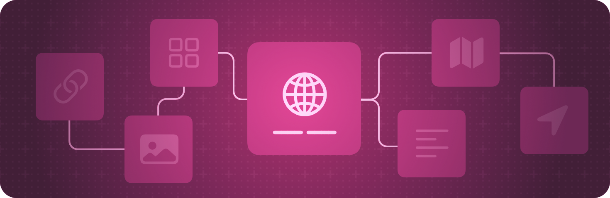

# 앱 구성

> 원문: [https://developer.apple.com/documentation/swiftui/app-organization](https://developer.apple.com/documentation/swiftui/app-organization)

앱의 진입점과 최상위 구조를 정의하세요.

### Overview

앱의 구조를 선언적으로 설명해보세요. 마치 뷰의 외관을 짜는 것과 비슷하게요!

[App](https://tabber.gitbook.io/swiftui\_docs\_kr/app-structure/undefined/app) 프로토콜을 준수하는 유형을 만들고, 이를 사용하여 앱의 UI를 나타내는 [Scene](../scenes.md)들을 하나하나 나열해보세요.

<figure><figcaption></figcaption></figure>

SwiftUI를 사용하면 Apple의 모든 플랫폼에서 작동하는 코드를 만들 수 있습니다. 그러나, 각 플랫폼의 특정 기능에 맞게 앱을 맞춤 설멍할 수도 있답니다. 예를 들자면, UIKit, AppKit, WatchKit 같이 앱의 Delegate로 콜백에 응답해야 하는 경우, 적절한 Delegate adaptor property wrapper인 [UIApplicationDelegateAdaptor](uiapplicationdelegateadaptor.md) 와 같은 Adaptor를 사용하면 Delegate 객체를 정의하고 앱 구조에서 인스턴스화 할 수 있습니다.

플랫폼별 디자인 가이드는 인터페이스 디자인 가이드의 [Platforms](https://developer.apple.com/design/human-interface-guidelines/platforms/overview) 섹션을 참조하세요.

***

### Topics

#### Creating an app

`protocol` [App](app.md)

&#x20;   앱의 구조와 동작을 나타내는 타입입니다.

#### Targeting iOS and iPadOS 

[UILaunchScreen](https://developer.apple.com/documentation/bundleresources/information\_property\_list/uilaunchscreen) (애플 공식 문서) \[영어]

&#x20;   앱이 시작될 때 보여지는 사용자 인터페이스 입니다.

[UILaunchScreens](https://developer.apple.com/documentation/bundleresources/information\_property\_list/uilaunchscreens) (애플 공식 문서) \[영어]

&#x20;   다른 URL schemes에 응답하여 앱이 시작될 때 보여지는 사용자 인터페이스 입니다.

`struct` [UIApplicationDelegateAdaptor](uiapplicationdelegateadaptor.md)

&#x20;   UIKit App Delegate를 생성하는 데 사용하는 프로퍼티 래퍼 타입입니다.

#### Targeting macOS 

`struct` [NSApplicationDelegateAdaptor](nsapplicationdelegateadaptor.md)

&#x20;   AppKit App Delegate를 생성하는 데 사용하는 프로퍼티 래퍼 타입입니다.

**Targeting watchOS**

`struct` [WKApplicationDelegateAdaptor](wkapplicationdelegateadaptor.md)

&#x20;   WatchKit에서 Delegte를 제공하기 위해 App에서 사용되는 프로퍼티 래퍼입니다.

`struct` [WKExtensionDelegateAdaptor](wkextensiondelegateadaptor.md)

&#x20;   WatchKit extension Delegate를 생성하는 데 사용하는 프로퍼티 래퍼 타입입니다.

***

### See Also

#### App structure

📔 [Scenes](../scenes.md)

&#x20;   앱의 구성 요소를 이루는 UI 그룹을 선언하세요.

📔 Windows

&#x20;   UI 컨텐츠를 창 또는 창들의 컬렉션에 표시하세요.

📔 Immersive spaces

&#x20;   사용자의 주변에 무제한 컨텐츠를 표시하세요.

📔 Documents

&#x20;   사용자가 도큐먼트를 열고 관리할 수 있도록 가능하게 하세요. (File Documents)

📔 Navigation

&#x20;   사용자가 하나의 씬 내에서 앱의 다른 부분으로 이동할 수 있도록 하세요.

📔 Modal presentations

&#x20;   종합적 인터렉션을 제공하는 별도의 뷰에 컨텐츠를 표시하세요.

📔 Toolbars

&#x20;   자주 사용되는 명령과 컨트롤에 즉각적인 접근을 제공하세요.

📔 Search

&#x20;   사용자가 앱 내에서 텍스트나 다른 콘텐츠를 검색할 수 있도록 가능하게 하세요.

📔 App extension

&#x20;   앱의 기본 기능을 위젯과 같은 시스템의 다른 부분으로 확장하세요.
